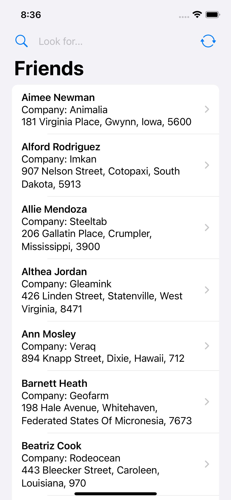
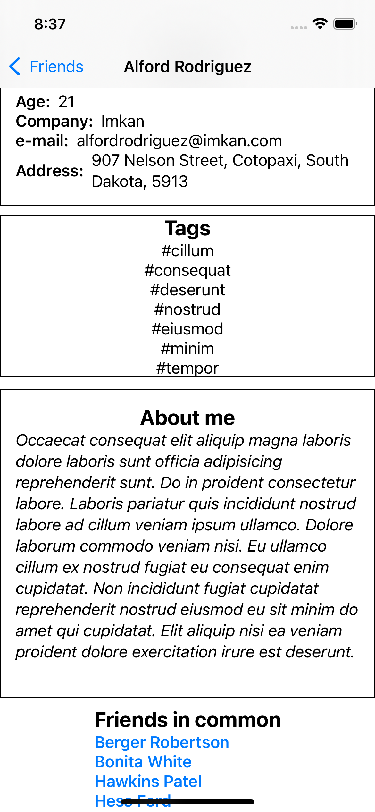

# FriendsApp
Challenge "Friends Face" iOS application done as part of the 100 Days of SwiftUI coursework: https://www.hackingwithswift.com/100/swiftui

# Description
This SwiftUI application fetches and shows randomly generated data for example users.
The app implements: URLSession, Codable, NavigationView, List, ObservableObject and dynamically filtering @FetchRequest.

    

# Requirements
iOS 14.0+
